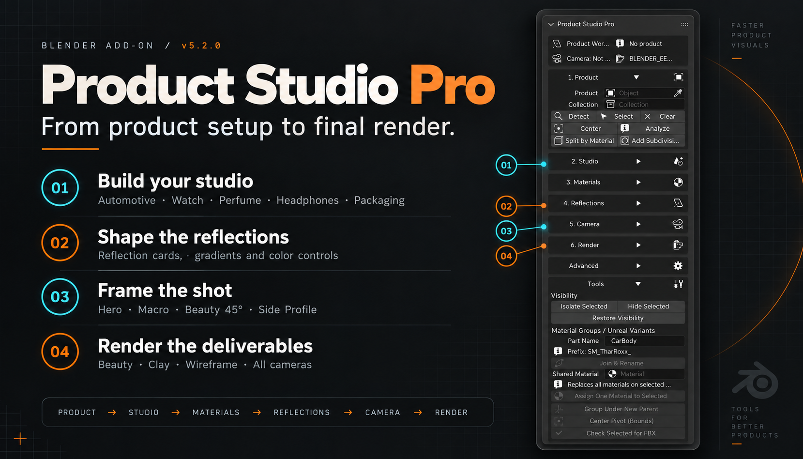
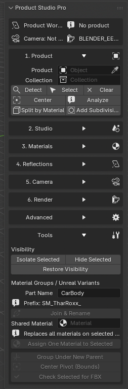

<p align="center">
  
</p>

<h1 align="center">Product Studio Pro</h1>
<p align="center"><strong>From product setup to final render.</strong><br>A focused product visualization workflow inside Blender.</p>
<p align="center"><strong>v5.2.0</strong> · Blender 5.1+ · GPL-2.0-or-later</p>
<p align="center"><a href="#get-started">Get started</a> · <a href="docs/USER_GUIDE.md">User guide</a> · <a href="docs/FEATURES.md">Feature tour</a> · <a href="CHANGELOG.md">Changelog</a></p>

Product Studio Pro brings asset preparation, studio lighting, materials, reflection cards, camera presets and render output into one Blender sidebar. Built by **Rahul Gambhir** for product visualization, with dedicated tools for automotive, watches, perfume, headphones and packaging.

## The highlights

| Feature | What you can do |
| :--- | :--- |
| **Five studio presets** | Build an automotive, watch, perfume, headphone or packaging studio, then refine the lighting with softbox, strip, rim and three-point lights. |
| **Reflection control** | Create rectangle, strip and edge cards; adjust size, position, rotation, strength, gradients and RGB or Kelvin color. |
| **Camera presets** | Start with Hero, Macro, Beauty 45° or Side Profile, then adjust the lens and depth of field. |
| **Render deliverables** | Produce beauty, clay, wireframe and transparent-background outputs for the active camera or every camera in the scene. |
| **Product material libraries** | Use 25 THAR ROXX finishes and an 11-material headphone library, including name-based headphone material assignment. |
| **Asset preparation** | Analyze imported assets, split by material, relink textures, group parts and check static vehicle parts before FBX export. |

## One sidebar. Six steps.

**Product → Studio → Materials → Reflections → Camera → Render**

1. **Choose the product.** Set the product object and, for multi-part assets, its collection.
2. **Build a studio.** Choose a preset and refine the lights and backdrop.
3. **Apply a finish.** Pick a material library or import your PBR maps.
4. **Shape the reflections.** Place and tune reflection cards around the product.
5. **Frame the shot.** Choose a camera preset and adjust composition and focus.
6. **Render.** Save the Blender scene, select your deliverables and render the shot or all cameras.

## Get started

**Requires Blender 5.1 or newer.** The declared minimum is 5.1.0; release smoke checks were run on Blender 5.1.2 on macOS. Other versions and operating systems have not been verified for this release.

1. Download **`ProductStudioPro-5.2.0.zip`** from this repository's Releases section once a release has been published.
2. Open Blender's **Edit → Preferences → Add-ons** and choose **Install from Disk** from the menu.
3. Select that ZIP and enable **Product Studio Pro**.
4. In the 3D Viewport, press **N** and open the **Product Studio** tab.

If no release has been published yet, build the install ZIP from a clone or extracted source download:

```sh
python3 scripts/build_release.py
```

Install the ZIP created in `dist/`. The repository source ZIP is a development bundle, not the Blender installer.

Read the [user guide](docs/USER_GUIDE.md) for product selection, render output and troubleshooting.

## A closer look

<details>
<summary><strong>View the original Blender sidebar screenshot</strong></summary>
<br>

</details>

The header is a designed feature illustration based on the supplied screenshot. The original capture above is the reference for the actual interface.

## Scope and limitations

- The **Tools** section currently uses `SM_TharRoxx_` naming and `GRP_TharRoxx` grouping. It is a static vehicle preparation workflow; it does not export FBX or create Unreal variants automatically.
- Headphone auto-assignment uses object names. Inspect the assignments on your own models.
- 3ds Max import and material translation depend on the source file and supported nodes. Complex renderer-specific shaders may require manual adjustment.
- The clean sidebar exposes the core workflow. Some registered legacy operators remain accessible through Blender search.
- Studio and material operations modify the current scene. Save your project before making broad changes.

## Development

```sh
python3 scripts/validate.py
python3 scripts/build_release.py
blender --background --factory-startup --python-exit-code 1 --python scripts/smoke_test.py
```

See [contributing](CONTRIBUTING.md), [validation notes](docs/VALIDATION.md) and the [release guide](docs/RELEASING.md).

## License and credits

Product Studio Pro is distributed under **GNU GPL version 2 or, at your option, any later version**. See [LICENSE](LICENSE) and [third-party notices](THIRD_PARTY_NOTICES.md).

Product and brand names identify workflows and presets only; no affiliation or endorsement is implied.
